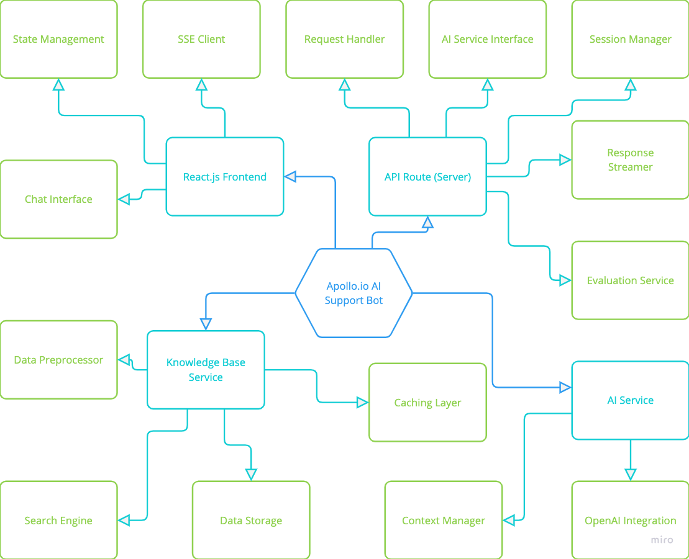

# Apollo.io AI Support Bot: Design Document

## 1. System Architecture

The Apollo.io AI Support Bot is built using a modern, scalable architecture designed to provide efficient and responsive user interactions. The various system components are now in a monolith application for the POC but can be easily distributed for scale. Here's an overview of the system components:

### Components:

1. **Next.js Frontend**:

   - **Chat Interface**: Allows user interaction.
   - **State Management**: Manages local chat history and UI states (loading, error).
   - **SSE Client**: Establishes and maintains SSE connection, processes incoming streamed responses.

2. **API Route (Server)**:

   - **Request Handler**: Parses incoming requests, validates input data.
   - **Session Manager**: Manages user sessions, handles conversation context.
   - **AI Service Interface**: Communicates with AI Service, formats data for AI processing.
   - **Response Streamer**: Implements SSE for real-time responses, manages connection lifecycle.
   - **Feedback API**: Collects user feedback on responses, including relevance scores.

3. **AI Service**:

   - **OpenAI Integration**: Formats prompts for OpenAI model.
   - **Context Manager**: Maintains conversation context, applies context-aware processing.

4. **Knowledge Base Service**:

   - **Data Storage**: Manages knowledge base and other data.
   - **Search Engine**: Implements efficient search algorithms, ranks and retrieves relevant information.
   - **Data Preprocessor**: Cleans and formats raw data, generates searchable indices.
   - **Caching Layer**: Implements in-memory caching for frequent queries.

5. **Evaluation Service**:
   - **Functionality**: Collects user feedback on bot responses, allowing for continuous improvement.
   - **Relevance Score**: A numerical score assigned to each response based on user feedback, used to adjust response generation algorithms.



## 2. Data Flow

The data flow from user input to bot response follows these steps:

1. User enters a query in the chat interface.
2. Frontend sends the query to the API Route.
3. API Route processes the query and retrieves conversation history.
4. AI Service is called with the query and relevant context.
5. AI Service retrieves relevant information from the Knowledge Base.
6. OpenAI processes the query and generates a response.
7. Response is streamed back through the API Route to the Frontend.
8. Frontend updates the UI in real-time with the streamed response.
9. User provides feedback on the response, which is sent to the Evaluation Service for processing.


## 3. Technology Stack

Our technology stack is chosen for its robustness, scalability, and developer-friendly features:

1. **Frontend**:

   - Next.js 14 (React framework)
   - TypeScript
   - TailwindCSS

   Reasoning: Next.js provides excellent performance on top of React.js, SEO benefits, and server-side rendering capabilities. TypeScript adds type safety, and TailwindCSS allows for rapid UI development.

2. **Backend**:

   - Next.js API Routes
   - Node.js

   Reasoning: Utilizing Next.js API Routes allows for a unified codebase and simplified deployment. Node.js provides a fast, event-driven environment for handling requests.

3. **AI Integration**:

   - OpenAI API

   Reasoning: OpenAI offers state-of-the-art language models, allowing for high-quality, context-aware responses.

4. **Knowledge Base**:

   - CSV file (for simplicity in the PoC)
   - Custom retrieval system

   Reasoning: A CSV file is used for ease of setup and modification. In a production environment, this would be replaced with a more robust database solution.

## 4. API Design

The main API endpoint for interacting with the bot is:

### Chat API

**POST /api/chat**

#### Request Body:

```json
{
  "message": "User's question or input",
  "history": [
    { "role": "user", "content": "Previous user message" },
    { "role": "assistant", "content": "Previous bot response" }
  ]
}
```

#### Response:

The API uses Server-Sent Events (SSE) to stream the response in real-time.

```json
#event: message
{
  "content": "Partial response content"
}
#event: message
{
  "content": "More response content"
}
#event: metrics
{
  "metrics": {
    "responseTime":1868,
    "responseLength":519,
    "relevanceScore":66.66666666666666
  },
  "id":"7bab4468-dbbe-4998-b622-95750d8aee2d"
}
$event: done
```

### Feedback API

**POST /api/feedback**

#### Request Body:

```json
{
  "messageId": "1726765568654",
  "feedback": "down"
}
```

#### Response:

```json
{
  "success": true,
  "feedback": {
    "thumbsUp": 0,
    "thumbsDown": 1
  }
}
```

## 5. Error Handling Scenarios

1. **OpenAI API Failure**:

   - Fallback to a predefined response

2. **Knowledge Base Access Error**:

   - Implement a fallback response when Knowledge is unavailable

3. **Rate Limiting**:

   - Implement token bucket algorithm to manage API call frequency
   - Inform users about temporary delays during high traffic

4. **Invalid User Input**:

   - Implement input validation on both client and server side
   - Provide clear error messages to guide users

5. **Session Management Issues**:
   - Provide users with options to refresh their session
